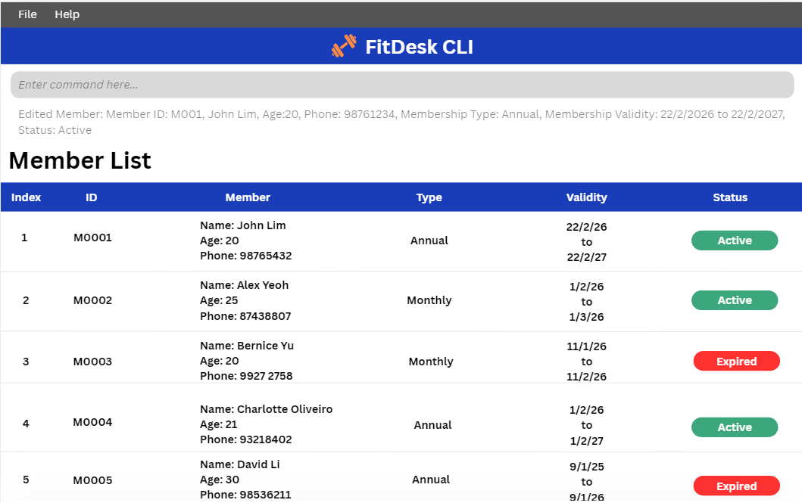

# FitDesk CLI

## Product Overview
FitDesk is a desktop application designed to help front-desk receptionists at small-to-medium private fitness gyms to manage member information efficiently.
The application features a **graphical user interface (GUI)** while being optimized for fast keyboard-based commands, allowing receptionists to perform tasks quickly.

## Target Users

## Benefits

## Key Features
### Membership Management:
* **Add new members** to the system with essential membership details
* **Remove inactive members** to keep member list updated
* **Edit member details** to update necessary information when needed
* **View all members** for quick reference

### Membership Tracking:
* **View membership status** to quickly determine whether memberships are active or expired
* **Track membership validity periods**, allowing receptionists to monitor start and expiry dates of members

## Product Website
For the detailed documentation of this project, see the **[FitDesk CLI Product Website](https://ay2526s2-cs2103t-w08-3.github.io/tp/)**.

## Acknowledgements
This project is based on the AddressBook-Level3 project created by the [SE-EDU initiative](https://se-education.org).
